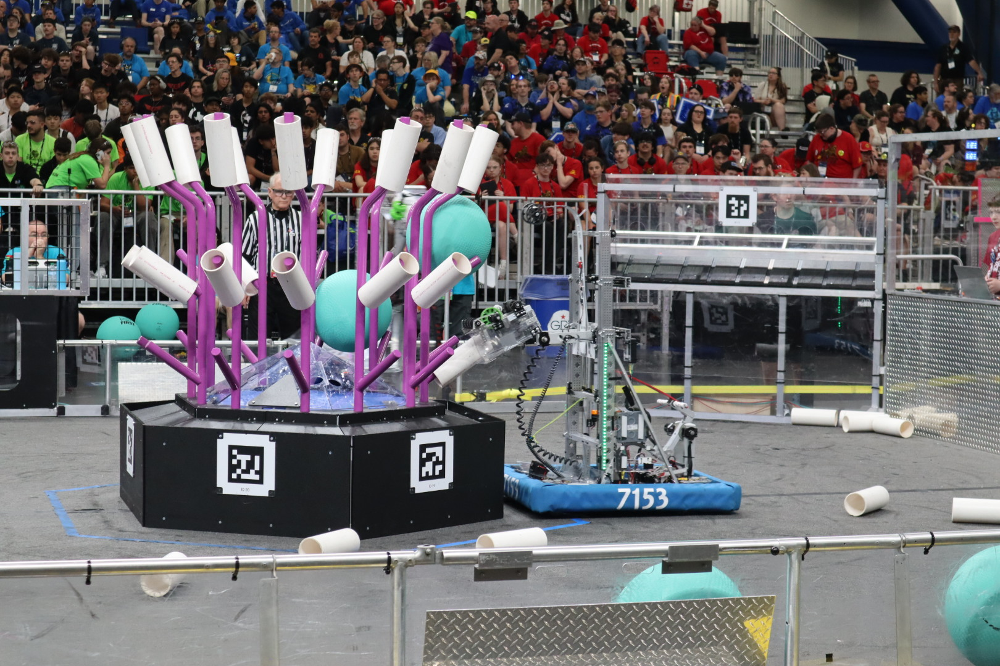
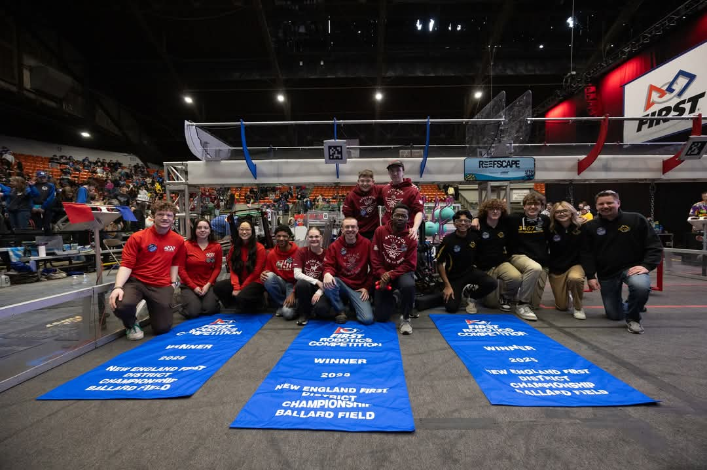
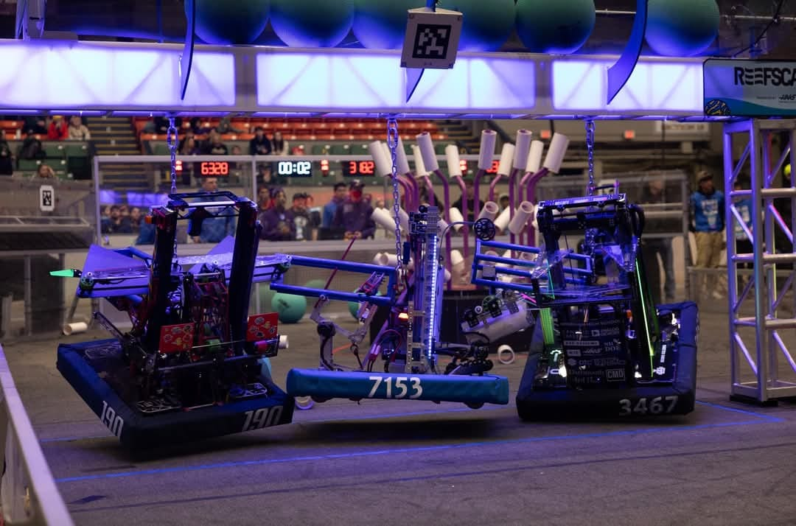

# Reefscape

*"Barnacle"* 
FRC 7153, Aetos Dios  
Reefscape, 2025 Season

## Overview
- SDS Mk4i L2 Swerve Modules, field-oriented drive
- 3 Stage elevator with pivoting end effector, allowing for scoring CORAL on all levels, descoring ALGAE from all levels, and scoring ALGAE into the BARGE
- Full auto-alignment with REEF and orientation-alignment with CORAL STATIONS
- Hook for DEEP CLIMB

## Controls
* **(Driver) Xbox Controller 0:**
    * **Left Joystick:** Drive base strafe
    * **Right Joystick:** Drive base rotation
    * **Left Joystick Held:** Sprint mode
	* **Left Trigger:** Sprint mode
	* **Right Trigger:** Coral intake
    * **Left Bumper:** Robot-oriented driving (as opposed to field-oriented)
	* **Right Bumper:** Rear robot-oriented driving (for CAGE alignment)
	* **X:** Lock onto nearest left REEF alignment targets
	* **A:** Lock onto nearest center REEF alignment targets
	* **B:** Lock onto nearest right REEF alignment targets
	* **Y:** Lock alignment onto nearest CORAL STATION
* **(Arms) Xbox Controller 1:**
    * **Right Bumper:** Run CORAL intake
	* **Right Trigger:** CORAL outtake (score)
	* **A:** Elevator to Coral L1
	* **X:** Elevator to Coral L2
	* **Y:** Elevator to Coral L3
	* **B:** Elevator to Coral L4
	* **POV Up:** High ALGAE intake state
	* **POV Down:** Low ALGAE intake state
	* **POV Left:** ALGAE PROCESSOR score position
	* **POV Right:** ALGAE BARGE score position
	* **Left Trigger:** ALGAE outtake (score)
	* **Left Bumper:** Algae spit
	* **Right Stick Press:** Deploy climber
	* **Left Stick Press:** Retract climber
	* **Left Stick Y:** (when pushed up) Force elevator down

### New England District Ballard Division Champions

As the second pick of an alliance led by [Team 3467: Windham Windup](http://www.team3467.org/) and with [Team 190: Gompei and the HERD](https://wp.wpi.edu/frc190/), we won the Ballard Division, and were finalists at the New England District Championship Event.

View Hardware IDs

### CAN IDs
0. RoboRio
1. Main Power Distribution Hub (REV PDH)
2. Front Right Swerve Drive Motor (Kraken/TalonFX)\*
3. Front Right Swerve Steer Motor (Neo/CAN Spark Max)
4. Front Right Swerve Steer Encoder (CTRE CANCoder)\*
5. Rear Right Swerve Drive Motor (Kraken/TalonFX)\*
6. Rear Right Swerve Steer Motor (Neo/CAN Spark Max)
7. Rear Right Swerve Steer Encoder (CTRE CANCoder)\*
8. Rear Left Swerve Drive Motor (Kraken/TalonFX)\*
9. Rear Left Swerve Steer Motor (Neo/CAN Spark Max)
10. Rear Left Swerve Steer Encoder (CTRE CANCoder)\*
11. Front Left Swerve Drive Motor (Kraken/TalonFX)\*
12. Front Left Swerve Steer Motor (Neo/CAN Spark Max)
13. Front Left Swerve Steer Encoder (CTRE CANCoder)\*
14. Elevator Leader Motor (Kraken/TalonFX)\*
15. Elevator Follower Motor (Kraken/TalonFX)\*
16. Manipulator Pivot Motor (Falcon500/TalonFX)\*
17. Climber Pivot Motor (Neo Vortex/Spark Flex)
18. Climber Winch Motor (Neo Vortex/Spark Flex)
19. Manipulator Flywheel Motor (Neo Vortex/Spark Flex)
20. Manipulator Sensors (CAN Spark Max)\*\*

\*All CTRE devices were on a secondary, CAN-FD bus titled "CANivore". 
\*\*Manipulator Sensors (CAN ID 20) was a CAN Spark Max with no motor attached. It had a REV Through Bore Encoder (attached to the manipulator pivot shaft) and a limit switch (to detect successful ALGAE intake).

### RoboRIO
- DIO 9: Climber Pivot Absolute Duty Cycle Encoder (REV Through Bore Encoder)
- PWM 9: LED Driver (REV Blinkin)

### REV Power Distribution Hub
- Switchable Channel: LED Driver Power (See PWM 9)

 

